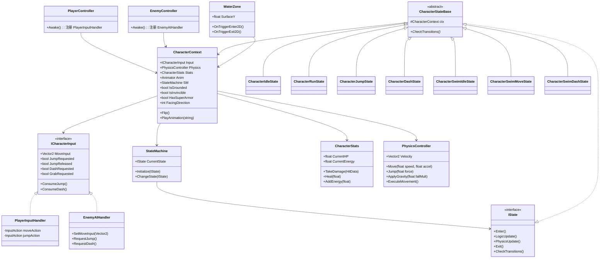
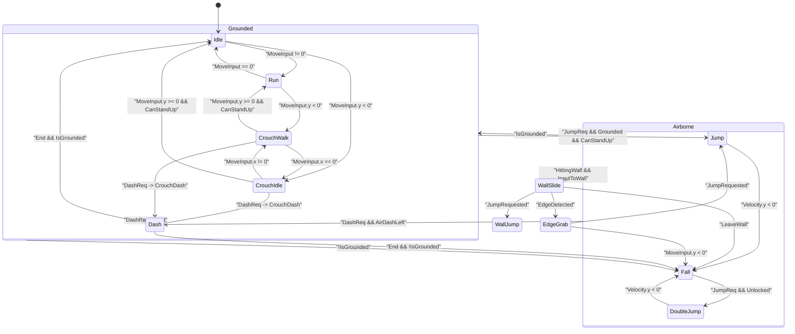
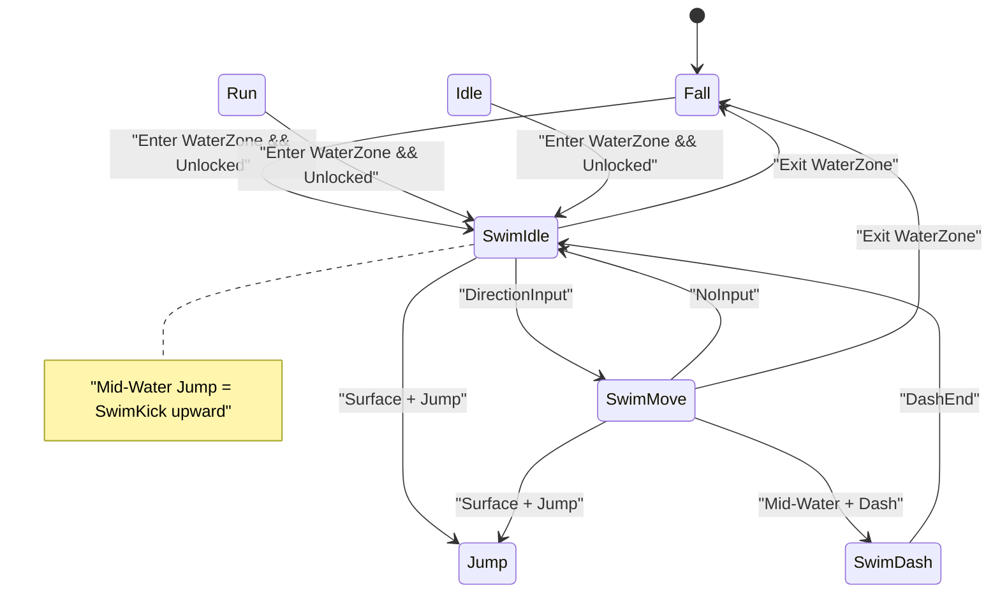

# 技术设计文档：Character Feature + P0-A 移动系统

> **@Designer 产出** | 依据 Feature Spec: [CharacterFeature.md](file:///d:/projects/ProjectXII/Docs/FeatureSpecs/CharacterFeature.md) + [CorePriority P0-A](file:///d:/projects/ProjectXII/Docs/FeatureSpecs/CorePriority.md)

---

## 1. 架构总览

### 1.1 核心设计理念：输入抽象 + 状态共享

Player、Enemy、NPC **共用同一套 Character States**，差异仅在于「谁在发指令」：

```
┌──────────────────────────────────────────────────────┐
│                  Controller 层（差异化）                │
│                                                      │
│  PlayerController         EnemyController            │
│       ↓                        ↓                     │
│  PlayerInputHandler       EnemyAIHandler             │
│  (人类按键)               (行为树/脚本AI)              │
│       ↓                        ↓                     │
│       └──── 均实现 ICharacterInput 接口 ────┘         │
├──────────────────────────────────────────────────────┤
│              StateMachine + 共享 States               │
│  CharacterIdleState / CharacterRunState / ...        │
│  States 读 ctx.Input.JumpRequested 做决策             │
├──────────────────────────────────────────────────────┤
│             CharacterContext (行为层枢纽)              │
│             CharacterStats (数值层)                   │
│             PhysicsController (物理层)                │
└──────────────────────────────────────────────────────┘
```

### 1.2 目录结构

```
Assets/Scripts/
├── Core/
│   ├── StateMachine/
│   │   ├── IState.cs
│   │   └── StateMachine.cs
│   ├── Character/
│   │   ├── CharacterContext.cs       ← 行为层枢纽（持有 ICharacterInput）
│   │   ├── CharacterStats.cs         ← 数值层
│   │   ├── IDamageable.cs
│   │   ├── HitData.cs
│   │   └── ICharacterInput.cs        ← [新增] 输入抽象接口
│   ├── Character/States/             ← [重点] 共享状态
│   │   ├── Grounded/
│   │   │   ├── CharacterIdleState.cs
│   │   │   └── CharacterRunState.cs
│   │   ├── Airborne/
│   │   │   ├── CharacterJumpState.cs
│   │   │   └── CharacterFallState.cs
│   │   ├── CharacterDashState.cs
│   │   ├── CharacterWallSlideState.cs
│   │   ├── CharacterWallJumpState.cs
│   │   ├── CharacterEdgeGrabState.cs
│   │   ├── Swim/                            ← 🔒
│   │   │   ├── CharacterSwimIdleState.cs
│   │   │   ├── CharacterSwimMoveState.cs
│   │   │   └── CharacterSwimDashState.cs
│   │   ├── CharacterDoubleJumpState.cs   ← 🔒
│   │   └── CharacterGrappleState.cs      ← 🔒
│   └── Physics/
│       └── PhysicsController.cs
│
├── Player/
│   ├── PlayerInputHandler.cs         ← 实现 ICharacterInput（人类输入）
│   └── PlayerController.cs           ← 注册 Input + 初始化状态机
│
├── Enemy/                            ← P0-B/P1 阶段扩展
│   ├── EnemyAIHandler.cs             ← 实现 ICharacterInput（AI 决策）
│   └── EnemyController.cs            ← 注册 AI + 初始化状态机
│
├── NPC/                              ← P1 阶段扩展
│   ├── NPCAIHandler.cs
│   └── NPCController.cs
│
└── Editor/
    └── TestSetup/
        └── P0A_TestSceneSetup.cs
```

### 1.3 类关系图



---

## 2. Core 模块详细设计

### 2.1 ICharacterInput 接口 🟢低风险

```csharp
namespace ProjectXII.Core.Character
{
    /// <summary>
    /// 输入抽象层。Player 通过物理按键实现，Enemy 通过 AI 实现。
    /// States 只读这个接口，不关心输入来源。
    /// </summary>
    public interface ICharacterInput
    {
        // --- 移动 ---
        Vector2 MoveInput { get; }              // 归一化方向
        int NormalizedInputX { get; }            // -1, 0, 1
        int NormalizedInputY { get; }            // -1, 0, 1

        // --- 动作请求（带缓存） ---
        bool JumpRequested { get; }              // 跳跃请求（含 Buffer）
        bool JumpReleased { get; }               // 松开跳跃键（用于可变跳高）
        bool DashRequested { get; }              // 冲刺请求
        bool GrabRequested { get; }              // 钩索请求 🔒

        // --- 消耗输入（防止重复触发） ---
        void ConsumeJump();
        void ConsumeDash();
        void ConsumeGrab();
    }
}
```

### 2.2 IState + StateMachine 🟢低风险

```csharp
namespace ProjectXII.Core
{
    public interface IState
    {
        void Enter();
        void LogicUpdate();
        void PhysicsUpdate();
        void Exit();
        void CheckTransitions();
    }

    public class StateMachine
    {
        public IState CurrentState { get; private set; }

        public void Initialize(IState startState)
        {
            CurrentState = startState;
            CurrentState.Enter();
        }

        private bool _isTransitioning;
        private IState _pendingState;

        public void ChangeState(IState newState)
        {
            if (_isTransitioning) { _pendingState = newState; return; }
            _isTransitioning = true;
            CurrentState.Exit();
            CurrentState = newState;
            CurrentState.Enter();
            _isTransitioning = false;
            if (_pendingState != null)
            {
                var pending = _pendingState;
                _pendingState = null;
                ChangeState(pending);
            }
        }

        public void Update()
        {
            CurrentState.LogicUpdate();
            CurrentState.CheckTransitions();
        }

        public void FixedUpdate()
        {
            CurrentState.PhysicsUpdate();
        }
    }
}
```

### 2.3 CharacterContext 🟡中风险

> 风险点：组件初始化顺序，以及 `ICharacterInput` 的注入时机。

```csharp
namespace ProjectXII.Core.Character
{
    public class CharacterContext : MonoBehaviour
    {
        // --- 输入抽象（由 Controller 注入） ---
        public ICharacterInput Input { get; private set; }

        // --- 组件引用 ---
        public Rigidbody2D Rb { get; private set; }
        public BoxCollider2D Collider { get; private set; }
        public Animator Anim { get; private set; }
        public CharacterStats Stats { get; private set; }
        public PhysicsController Physics { get; private set; }
        public StateMachine SM { get; private set; }

        // --- 状态标志 ---
        public bool IsGrounded { get; set; }
        public bool IsInvincible { get; set; }
        public bool HasSuperArmor { get; set; }
        public bool CanAct { get; set; } = true;
        public int FacingDirection { get; private set; } = 1;

        // --- 移动参数（ScriptableObject 或 Serializable） ---
        [SerializeField] private CharacterMovementData moveData;
        public CharacterMovementData MoveData => moveData;

        protected virtual void Awake()
        {
            Rb = GetComponent<Rigidbody2D>();
            Collider = GetComponent<BoxCollider2D>();
            Anim = GetComponentInChildren<Animator>();
            Stats = GetComponent<CharacterStats>();
            Physics = GetComponent<PhysicsController>();
            SM = new StateMachine();
        }

        /// <summary>
        /// 由各 Controller 调用，注入对应的输入源
        /// </summary>
        public void SetInput(ICharacterInput input) => Input = input;

        public void Flip()
        {
            FacingDirection *= -1;
            transform.Rotate(0f, 180f, 0f);
        }

        public void PlayAnimation(string animName)
        {
            if (Anim != null) Anim.Play(animName);
        }
    }
}
```

### 2.4 CharacterStats + IDamageable 🟢低风险

```csharp
namespace ProjectXII.Core.Character
{
    public interface IDamageable
    {
        void TakeDamage(HitData data);
        CharacterContext GetContext();
    }

    public class CharacterStats : MonoBehaviour, IDamageable
    {
        [Header("HP")]
        [SerializeField] private float maxHP = 100f;
        public float CurrentHP { get; private set; }

        [Header("Energy (P0-D 预埋)")]
        [SerializeField] private float maxEnergy = 100f;
        public float CurrentEnergy { get; private set; }

        public event System.Action OnDeath;
        public event System.Action<float> OnDamaged;
        public event System.Action<float> OnHeal;
        public event System.Action<float> OnEnergyChanged;

        private CharacterContext _context;

        private void Awake()
        {
            _context = GetComponent<CharacterContext>();
            CurrentHP = maxHP;
            CurrentEnergy = 0f;
        }

        public void TakeDamage(HitData data)
        {
            CurrentHP -= data.Damage;
            OnDamaged?.Invoke(data.Damage);
            if (CurrentHP <= 0f) { CurrentHP = 0f; OnDeath?.Invoke(); }
        }

        public CharacterContext GetContext() => _context;
        public void Heal(float amount) { CurrentHP = Mathf.Min(CurrentHP + amount, maxHP); OnHeal?.Invoke(amount); }
        public void AddEnergy(float amount) { CurrentEnergy = Mathf.Min(CurrentEnergy + amount, maxEnergy); OnEnergyChanged?.Invoke(CurrentEnergy); }
        public bool TryConsumeEnergy(float amount) { if (CurrentEnergy < amount) return false; CurrentEnergy -= amount; OnEnergyChanged?.Invoke(CurrentEnergy); return true; }
    }

    public struct HitData
    {
        public float Damage;
        public Vector2 KnockbackDirection;
        public float KnockbackForce;
        public float HitStopDuration;
    }
}
```

### 2.5 PhysicsController 🔴高风险

> 与前版相同，此处省略重复。详见 `PhysicsController` 完整代码（未改动）。

---

## 3. 共享状态机详细设计

### 3.1 状态转移图（Player/Enemy 共用）



> 注意转移条件全部基于 `ctx.Input.*` 和 `ctx.Physics.*`，与具体输入源无关。

### 3.2 共享状态基类

```csharp
namespace ProjectXII.Core.Character.States
{
    /// <summary>
    /// 所有 Character 共享状态的基类。
    /// 读取 ctx.Input（ICharacterInput）做决策，Player 和 Enemy 共用。
    /// </summary>
    public abstract class CharacterStateBase : IState
    {
        protected readonly CharacterContext ctx;

        protected CharacterStateBase(CharacterContext ctx)
        {
            this.ctx = ctx;
        }

        // 便捷访问
        protected ICharacterInput Input => ctx.Input;
        protected PhysicsController Physics => ctx.Physics;
        protected CharacterMovementData Data => ctx.MoveData;

        public virtual void Enter() { }
        public virtual void LogicUpdate() { }
        public virtual void PhysicsUpdate() { }
        public virtual void Exit() { }
        public abstract void CheckTransitions();
    }
}
```

### 3.2b CharacterStateRegistry（状态注册表）

> 由 Controller 创建所有状态实例，注册到此处。各状态通过 `ctx.States.XXX` 访问其他状态实例，解决状态间的循环依赖。

```csharp
namespace ProjectXII.Core.Character.States
{
    public class CharacterStateRegistry
    {
        public CharacterIdleState Idle;
        public CharacterRunState Run;
        public CharacterJumpState Jump;
        public CharacterFallState Fall;
        public CharacterDashState Dash;
        public CharacterWallSlideState WallSlide;
        public CharacterWallJumpState WallJump;
        public CharacterEdgeGrabState EdgeGrab;

        // 蹲下系统
        public CharacterCrouchIdleState CrouchIdle;
        public CharacterCrouchWalkState CrouchWalk;
        public CharacterCrouchDashState CrouchDash;

        // 🔒 解锁后注册
        public CharacterSwimIdleState SwimIdle;
        public CharacterSwimMoveState SwimMove;
        public CharacterSwimDashState SwimDash;
        // public CharacterDoubleJumpState DoubleJump;
        // public CharacterGrappleState Grapple;
    }
}
```

> `CharacterContext` 中已有 `public CharacterStateRegistry States { get; private set; }` 和 `SetStates()` 方法。Controller 在 `Awake` 中创建 Registry 并注入。

### 3.3 各状态核心逻辑

| 状态                         | Enter                                   | PhysicsUpdate                              | CheckTransitions                                                                                  |
| ---------------------------- | --------------------------------------- | ------------------------------------------ | ------------------------------------------------------------------------------------------------- |
| **CharacterIdleState**       | `PlayAnimation("Idle")`                 | `Physics.Move(0, Data.decel)`              | MoveInput→Run, Jump→Jump, !Grounded→Fall, Dash→Dash                                               |
| **CharacterRunState**        | `PlayAnimation("Run")`, Flip            | `Physics.Move(speed, Data.accel)`          | noInput→Idle, Jump→Jump, !Grounded→Fall, Dash→Dash                                                |
| **CharacterJumpState**       | `Physics.Jump()`, `Input.ConsumeJump()` | `ApplyGravity(1)`, `JumpReleased?→CutJump` | Vy<0→Fall, Wall→WallSlide, Dash→Dash                                                              |
| **CharacterFallState**       | 启动 Coyote Timer                       | `ApplyGravity(fallMult)`                   | Grounded→Idle, Wall→WallSlide, CoyoteJump→Jump                                                    |
| **CharacterDashState**       | 冻结重力, `SetInvincible`, 设冲刺速度   | 沿方向移动                                 | 结束→Idle/Fall                                                                                    |
| **CharacterWallSlideState**  | 降低下落速度                            | `ApplyGravity(wallGravity)`                | Jump→WallJump, 离墙→Fall, Edge→EdgeGrab                                                           |
| **CharacterWallJumpState**   | 反方向弹射, 短暂锁定输入                | `ApplyGravity(1)`                          | 锁定结束→Fall                                                                                     |
| **CharacterEdgeGrabState**   | 冻结重力+速度, Snap                     | 无                                         | Jump→翻上, Down→Fall                                                                              |
| **CharacterCrouchIdleState** | 收缩碰撞体                              | `Physics.Move(0, Data.decel)`              | 按左右→CrouchWalk, Jump→Jump(需无遮挡), 松开下→Idle                                               |
| **CharacterCrouchWalkState** | 收缩碰撞体                              | `Physics.Move(crouchSpeed, Data.accel)`    | 无按键→CrouchIdle, Jump→Jump(需无遮挡), 松开下→Run                                                |
| **CharacterCrouchDashState** | 收缩碰撞体, 冻结重力, 无敌              | 沿方向移动                                 | 结束且无遮挡→Idle/Run，有遮挡→CrouchIdle/Walk                                                     |
| **CharacterSwimIdleState** 🔒 | 播放 `SwimIdle`，关闭重力               | 施加浮力。**水底触地则不施加**             | 有方向→SwimMove, 触地+下→CrouchIdle, 水面+Jump→出水Jump, 水中+Jump→蹬水, 出水→Fall                |
| **CharacterSwimMoveState** 🔒 | 播放 `SwimMove`，Flip                   | `swimSpeed` 四方向 + 水阻                  | 无输入→SwimIdle, 触地+下→CrouchWalk, Dash→SwimDash, 水面+Jump→出水Jump, 水中+Jump→蹬水, 出水→Fall |
| **CharacterSwimDashState** 🔒 | 播放 `SwimDash`，冻结输入               | 水中高速滑行 (`dashSpeed`*系数)            | 结束→SwimIdle/SwimMove, 入水底→CrouchDash/Dash                                                    |

### 3.4 CharacterMovementData（共享参数配置）

```csharp
[CreateAssetMenu(fileName = "MovementData", menuName = "ProjectXII/Movement Data")]
public class CharacterMovementData : ScriptableObject
{
    [Header("Ground Movement")]
    public float moveSpeed = 10f;
    public float acceleration = 80f;
    public float deceleration = 80f;

    [Header("Jump")]
    public float jumpHeight = 3.5f;
    public float timeToJumpApex = 0.35f;
    public float jumpCutMultiplier = 0.5f;
    public float fallGravityMultiplier = 1.8f;
    public float coyoteTime = 0.1f;
    public float jumpBufferTime = 0.15f;

    [Header("Dash")]
    public float dashSpeed = 20f;
    public float dashDuration = 0.15f;
    public float dashCooldown = 0.5f;
    public int maxAirDashes = 1;

    [Header("Wall")]
    public float wallSlideSpeed = -2f;
    public Vector2 wallJumpForce = new Vector2(12f, 16f);
    public float wallJumpInputLockTime = 0.15f;

    [Header("Edge Grab")]
    public Vector2 edgeGrabOffset = new Vector2(0.3f, -0.1f);

    [Header("Crouch")]
    public float crouchWalkSpeed = 4f;
    public float crouchColliderScale = 0.5f;
    public float crouchDashSpeed = 18f;
    public float crouchDashDuration = 0.2f;

    [Header("Swim 🔒")]
    public float swimSpeed = 6f;            // 水中移速（约 60% moveSpeed）
    public float swimAcceleration = 40f;     // 水中加速度（比地面低 = 阻力感）
    public float buoyancy = 2f;              // 无输入时每秒上浮速度
    public float waterJumpForce = 12f;       // 出水弹射力
    public float swimJumpBurst = 8f;         // 水中向上蹬水爆发力
    public float waterDamagePenalty = 1f;    // 未解锁入水惩罚（落水统一扣1血并回安全点）

    [Header("Unlockable (🔒)")]
    public bool doubleJumpUnlocked = false;
    public bool swimUnlocked = false;
    public bool grappleUnlocked = false;
}
```

> 使用 `ScriptableObject` 实现数据驱动。Player 和 Enemy 可以引用不同的 `MovementData` 资产，实现不同的移速/跳高参数。

---

## 4. Controller 层设计

### 4.1 PlayerController（精简版）

```csharp
namespace ProjectXII.Player
{
    public class PlayerController : MonoBehaviour
    {
        private CharacterContext _ctx;
        private PlayerInputHandler _input;

        // 状态实例缓存
        private CharacterIdleState _idleState;
        private CharacterRunState _runState;
        private CharacterJumpState _jumpState;
        // ... 其他状态

        private void Awake()
        {
            _ctx = GetComponent<CharacterContext>();
            _input = GetComponent<PlayerInputHandler>();

            // 注入输入源
            _ctx.SetInput(_input);

            // 创建共享状态实例
            _idleState = new CharacterIdleState(_ctx);
            _runState = new CharacterRunState(_ctx);
            _jumpState = new CharacterJumpState(_ctx);
            // ...

            // 初始化物理参数
            _ctx.Physics.CalculateJumpPhysics(
                _ctx.moveData.jumpHeight,
                _ctx.moveData.timeToJumpApex);

            // 启动状态机
            _ctx.SM.Initialize(_idleState);
        }

        private void Update() => _ctx.SM.Update();
        private void FixedUpdate()
        {
            _ctx.SM.FixedUpdate();
            _ctx.Physics.ExecuteMovement();
        }
    }
}
```

### 4.2 EnemyController（P0-B 阶段扩展，此处预留结构）

```csharp
namespace ProjectXII.Enemy
{
    public class EnemyController : MonoBehaviour
    {
        private CharacterContext _ctx;
        private EnemyAIHandler _ai;

        private void Awake()
        {
            _ctx = GetComponent<CharacterContext>();
            _ai = GetComponent<EnemyAIHandler>();

            _ctx.SetInput(_ai); // AI 也实现了 ICharacterInput！

            // 同样使用共享状态，但可能不注册 WallSlide/EdgeGrab 等
            var idleState = new CharacterIdleState(_ctx);
            var runState = new CharacterRunState(_ctx);
            _ctx.SM.Initialize(idleState);
        }

        private void Update() => _ctx.SM.Update();
        private void FixedUpdate()
        {
            _ctx.SM.FixedUpdate();
            _ctx.Physics.ExecuteMovement();
        }
    }
}
```

### 4.3 EnemyAIHandler 示例（实现 ICharacterInput）

```csharp
namespace ProjectXII.Enemy
{
    /// <summary>
    /// AI 通过代码/行为树设置输入值，States 读取时与人类输入无异。
    /// </summary>
    public class EnemyAIHandler : MonoBehaviour, ICharacterInput
    {
        public Vector2 MoveInput { get; private set; }
        public int NormalizedInputX => Mathf.RoundToInt(MoveInput.x);
        public int NormalizedInputY => Mathf.RoundToInt(MoveInput.y);
        public bool JumpRequested { get; private set; }
        public bool JumpReleased { get; private set; }
        public bool DashRequested { get; private set; }
        public bool GrabRequested { get; private set; }

        // --- AI 调用这些方法来"模拟按键" ---
        public void SetMoveInput(Vector2 dir) => MoveInput = dir;
        public void RequestJump() { JumpRequested = true; JumpReleased = false; }
        public void RequestDash() => DashRequested = true;
        public void ReleaseJump() => JumpReleased = true;

        public void ConsumeJump() => JumpRequested = false;
        public void ConsumeDash() => DashRequested = false;
        public void ConsumeGrab() => GrabRequested = false;
    }
}
```

---

## 5. PlayerInputHandler 设计 🟡中风险

实现 `ICharacterInput` 接口，将 Unity New Input System 的原始输入转化为标准化的输入请求：

```csharp
namespace ProjectXII.Player
{
    public class PlayerInputHandler : MonoBehaviour, ICharacterInput
    {
        // --- ICharacterInput 实现 ---
        public Vector2 MoveInput { get; private set; }
        public int NormalizedInputX { get; private set; }
        public int NormalizedInputY { get; private set; }
        public bool JumpRequested { get; private set; }
        public bool JumpReleased { get; private set; }
        public bool DashRequested { get; private set; }
        public bool GrabRequested { get; private set; }

        [SerializeField] private float jumpBufferTime = 0.15f;
        [SerializeField] private float dashBufferTime = 0.15f;
        private float _jumpRequestTime = -1f;
        private float _dashRequestTime = -1f;

        private InputAction moveAction, jumpAction, dashAction;

        private void Awake()
        {
            moveAction = new InputAction("Move", binding: "<Gamepad>/leftStick");
            moveAction.AddCompositeBinding("Dpad")
                .With("Up", "<Keyboard>/w").With("Up", "<Keyboard>/upArrow")
                .With("Down", "<Keyboard>/s").With("Down", "<Keyboard>/downArrow")
                .With("Left", "<Keyboard>/a").With("Left", "<Keyboard>/leftArrow")
                .With("Right", "<Keyboard>/d").With("Right", "<Keyboard>/rightArrow");

            jumpAction = new InputAction("Jump", binding: "<Gamepad>/buttonSouth");
            jumpAction.AddBinding("<Keyboard>/space");
            jumpAction.started += _ => OnJumpInput();
            jumpAction.canceled += _ => OnJumpRelease();

            dashAction = new InputAction("Dash", binding: "<Gamepad>/rightTrigger");
            dashAction.AddBinding("<Keyboard>/leftShift");
            dashAction.started += _ => OnDashInput();
        }

        private void Update()
        {
            MoveInput = moveAction.ReadValue<Vector2>();
            NormalizedInputX = Mathf.RoundToInt(MoveInput.x);
            NormalizedInputY = Mathf.RoundToInt(MoveInput.y);
            CheckBufferExpiry();
        }

        private void OnJumpInput() { JumpRequested = true; JumpReleased = false; _jumpRequestTime = Time.time; }
        private void OnJumpRelease() { JumpReleased = true; }
        private void OnDashInput() { DashRequested = true; _dashRequestTime = Time.time; }

        private void CheckBufferExpiry()
        {
            if (JumpRequested && Time.time >= _jumpRequestTime + jumpBufferTime) JumpRequested = false;
            if (DashRequested && Time.time >= _dashRequestTime + dashBufferTime) DashRequested = false;
        }

        public void ConsumeJump() => JumpRequested = false;
        public void ConsumeDash() => DashRequested = false;
        public void ConsumeGrab() => GrabRequested = false;

        private void OnEnable() { moveAction.Enable(); jumpAction.Enable(); dashAction.Enable(); }
        private void OnDisable() { moveAction.Disable(); jumpAction.Disable(); dashAction.Disable(); }
    }
}
```

---

## 6. 决策层 vs 执行层 架构

状态机和行为树解决的是**不同层级的问题**。本项目中两者配合使用，互补而非互斥：

### 6.1 分层架构图

```
┌───────────────────────────────────────────────────┐
│  决策层 (Decision Layer) — "该做什么？"            │
│                                                   │
│  Player: 人类按键                                  │
│  Enemy:  Behavior Designer 行为树                  │
│  NPC:    简单脚本（巡逻/对话/触发器）               │
├───────────────────────────────────────────────────┤
│  指令层 (Command Layer) — ICharacterInput           │
│                                                   │
│  PlayerInputHandler.JumpRequested = true           │
│  EnemyAIHandler.RequestJump()                     │
│  NPCAIHandler.SetMoveInput(patrol direction)      │
├───────────────────────────────────────────────────┤
│  执行层 (Execution Layer) — 共享 CharacterStates   │
│                                                   │
│  CharacterIdleState → CharacterRunState            │
│  → CharacterJumpState → CharacterFallState ...    │
│  （不关心指令来源，只执行动作）                      │
├───────────────────────────────────────────────────┤
│  物理层 (Physics Layer) — PhysicsController        │
│  Move() / Jump() / ApplyGravity() / ExecuteMovement() │
└───────────────────────────────────────────────────┘
```

### 6.2 各实体的决策层实现方式

| 实体       | 决策层                          | 指令层               | 执行层                                   |
| ---------- | ------------------------------- | -------------------- | ---------------------------------------- |
| **Player** | 人类输入（键盘/手柄）           | `PlayerInputHandler` | 共享 `CharacterXXXState`                 |
| **Enemy**  | Behavior Designer 行为树        | `EnemyAIHandler`     | 共享 `CharacterXXXState`                 |
| **Boss**   | Behavior Designer（多阶段子树） | `EnemyAIHandler`     | 共享 `CharacterXXXState` + Boss 专属状态 |
| **NPC**    | 简单巡逻/触发器脚本             | `NPCAIHandler`       | 共享 `CharacterXXXState`（仅 Idle/Run）  |

### 6.3 行为树如何驱动共享状态机（Enemy 示例）

```
Behavior Designer 行为树节点
│
├── Selector: 战术决策
│   ├── Sequence: 追击玩家
│   │   ├── Condition: 玩家在视野内?
│   │   ├── Action: aiHandler.SetMoveInput(朝玩家方向)
│   │   └── Condition: 到达攻击范围? → 触发攻击
│   │
│   ├── Sequence: 巡逻
│   │   ├── Action: aiHandler.SetMoveInput(巡逻方向)
│   │   └── Condition: 到达巡逻点? → 翻转方向
│   │
│   └── Sequence: 跳过障碍
│       ├── Condition: 前方有障碍?
│       └── Action: aiHandler.RequestJump()
│
↓ ICharacterInput 接口
↓
共享 CharacterRunState / CharacterJumpState
（和 Player 完全相同的执行逻辑）
```

> 行为树的 Action 节点只需调用 `aiHandler.SetMoveInput()` / `aiHandler.RequestJump()` 等简单方法。所有复杂的物理计算、动画切换、碰撞检测都由执行层的共享状态处理。

### 6.4 实现时序

| 阶段  | 决策层实现                                              |
| ----- | ------------------------------------------------------- |
| P0-A  | Player 使用 `PlayerInputHandler`（人类输入）            |
| P0-B  | 基础敌人使用 `EnemyAIHandler`（简单脚本 AI：站桩/巡逻） |
| P0-C+ | 引入 Behavior Designer 行为树，替换简单脚本 AI          |
| P1    | NPC 使用 `NPCAIHandler`（巡逻/对话）                    |

---

### 6.5 游泳系统详细设计（🔒 剧情解锁）

> **设计参考**：《空洞骑士》酸液区（未解锁时入水受伤）+ 《洛克人X》水下手感（浮力 + 阻力）

#### 核心机制

| 维度             | 设计                                                                                                                                                                                                                                                                                                                                                                                                          |
| ---------------- | ------------------------------------------------------------------------------------------------------------------------------------------------------------------------------------------------------------------------------------------------------------------------------------------------------------------------------------------------------------------------------------------------------------- |
| **触发方式**     | `WaterZone` Trigger 判定：`OnTriggerEnter` 触发入水，**`OnTriggerExit` 触发出水**                                                                                                                                                                                                                                                                                                                             |
| **移动手感**     | 水中移速 `swimSpeed`，取消重力，四方向自由移动（左右无转向硬直）                                                                                                                                                                                                                                                                                                                                              |
| **浮力系统**     | 无输入时以 `buoyancy` 上浮。**若顶部触及水面，则 Clamp Y坐标停止上浮（防止水面鬼畜抖动）**                                                                                                                                                                                                                                                                                                                    |
| **水阻感**       | 降低 `swimAcceleration`，营造粘滞感                                                                                                                                                                                                                                                                                                                                                                           |
| **深度分层交互** | `Swim` 状态中不再一刀切禁用动作，而是根据角色深度和是否触底进行上下文判断：<br>1. **水面 (Surface)**：按下即潜入水中。禁用水面Dash。<br>2. **水中 (Mid-Water)**：按下为正常下潜。按Dash触发专用的 **`CharacterSwimDashState`（水中冲刺）**。<br>3. **水底 (Water Bottom)**：当水中触碰地面（`IsGrounded`）时，**行走逻辑恢复为地面状态（可正常触发 Crouch / Dash / Run 等）**，但移动速度受水阻系数影响减弱。 |
| **跳出与上浮**   | 1. **水面待机**：按跳跃 → 施加 `waterJumpForce` 弹出水面，转化为 `Jump` 状态。<br>2. **水中悬浮**：**按跳跃 → 施加一次向上的瞬时爆发力 `swimJumpBurst`**（模拟真实游泳蹬腿），可配合方向键实现斜向快速上移（有极短CD防止连按飞天）。<br>3. **水底触地**：按跳跃 → 执行正常的地面起跳（浮力抵消部分重力，跳得更高更慢）。                                                                                      |
| **未解锁惩罚**   | `swimUnlocked = false` 入水 → **等同于落入深渊，扣血并黑屏传送回最后安全 Respawn 点**                                                                                                                                                                                                                                                                                                                         |

#### 新增状态

| 状态                         | Enter                     | PhysicsUpdate                   | CheckTransitions                                                                                           |
| ---------------------------- | ------------------------- | ------------------------------- | ---------------------------------------------------------------------------------------------------------- |
| **CharacterSwimIdleState** 🔒 | 播放 `SwimIdle`，关闭重力 | 施加浮力。**水底触地则不施加**  | 有方向输入→SwimMove, 按下且触地→CrouchIdle, 水面+Jump→出水Jump, 水中+Jump→向上蹬水(仍在此状态), 出水→Fall  |
| **CharacterSwimMoveState** 🔒 | 播放 `SwimMove`，Flip     | `swimSpeed` 四方向移动 + 水阻   | 无输入→SwimIdle, 触地且向下→CrouchWalk, 按Dash→SwimDash, 水面+Jump→出水Jump, 水中+Jump→向上蹬水, 出水→Fall |
| **CharacterSwimDashState** 🔒 | 播放 `SwimDash`，冻结输入 | 水中高速滑行 (`dashSpeed`*系数) | 结束→SwimIdle/SwimMove, 入水底→CrouchDash/Dash                                                             |

#### 环境组件 — WaterZone

```csharp
namespace ProjectXII.Core.Character
{
    /// <summary>
    /// 水域触发器。放置于场景中，角色进入时切换到游泳状态。
    /// </summary>
    [RequireComponent(typeof(BoxCollider2D))]
    public class WaterZone : MonoBehaviour
    {
        /// <summary>水面 Y 坐标（Trigger 顶部）</summary>
        public float SurfaceY => transform.position.y + GetComponent<BoxCollider2D>().size.y * 0.5f;

        private void OnTriggerEnter2D(Collider2D other)
        {
            var ctx = other.GetComponent<CharacterContext>();
            if (ctx == null) return;
            ctx.EnterWater(this);
        }

        private void OnTriggerExit2D(Collider2D other)
        {
            var ctx = other.GetComponent<CharacterContext>();
            if (ctx == null) return;
            ctx.ExitWater();
        }
    }
}
```

#### CharacterContext 扩展

```csharp
// CharacterContext 新增
public WaterZone CurrentWater { get; private set; }
public bool IsInWater => CurrentWater != null;

public void EnterWater(WaterZone water)
{
    CurrentWater = water;
    if (!MoveData.swimUnlocked)
    {
        // 未解锁：视同深渊（Abyss）逻辑 -> 扣血、黑屏、传送回安全点 (Respawn)
        Stats.TakeDamage(new HitData { Damage = MoveData.waterDamagePenalty });
        // TODO: 触发 LevelManager.Instance.RespawnAtLastSafePoint()
        CurrentWater = null;
        return;
    }
    // 已解锁：进入游泳状态
    FireFeedback("water_enter");
    SM.ChangeState(States.SwimIdle);
}

public void ExitWater()
{
    CurrentWater = null;
    FireFeedback("water_exit");
}
```

#### 状态转移图扩展




## 6.6 反馈事件接口（P0-A 预埋，P0-B 接入 MMFeedbacks）

> **设计原则**：先确定机制，再加 Juice。P0-A 只预埋事件触发点，P0-B 引入 MMFeedbacks 后通过 `FeedbackRouter` 统一接入。

### CharacterContext 事件总线

```csharp
// CharacterContext 中预埋
public event System.Action<string> OnFeedbackEvent;
public void FireFeedback(string feedbackId) => OnFeedbackEvent?.Invoke(feedbackId);
```

### 各状态推荐触发点

| 状态                 | 事件 ID             | 触发时机         | 预期特效（P0-B） |
| -------------------- | ------------------- | ---------------- | ---------------- |
| JumpState            | `jump_start`        | Enter            | 起跳粒子         |
| FallState → Grounded | `land_impact`       | CheckTransitions | 落地烟尘 + 微震  |
| DashState            | `dash_start`        | Enter            | 残影拖尾         |
| CrouchDashState      | `crouch_dash_start` | Enter            | 贴地火花         |
| WallSlideState       | `wall_slide`        | Enter            | 墙壁摩擦火花     |
| EdgeGrabState        | `edge_grab`         | Enter            | 抓取粒子         |

### P0-B 接入方案（预览）

```csharp
// FeedbackRouter.cs — 监听事件并转发给 MMF_Player
public class FeedbackRouter : MonoBehaviour
{
    [System.Serializable]
    public struct FeedbackEntry
    {
        public string feedbackId;
        public MMF_Player player;
    }
    public FeedbackEntry[] entries;

    void OnEnable() => GetComponent<CharacterContext>().OnFeedbackEvent += Route;
    void OnDisable() => GetComponent<CharacterContext>().OnFeedbackEvent -= Route;
    void Route(string id) { foreach (var e in entries) if (e.feedbackId == id) e.player?.PlayFeedbacks(); }
}
```

---

## 7. 测试验证计划

### 7.1 Editor 自动化脚本
`P0A_TestSceneSetup.cs`：一键创建灰盒场景 + Player 对象 + 所有组件挂载。

### 7.2 手动验收测试用例

| 编号 | 测试项       | 操作                     | 预期结果                      |
| ---- | ------------ | ------------------------ | ----------------------------- |
| T01  | 水平移动     | 按住 A/D                 | 立即移动，松开快速停止        |
| T02  | 可变跳跃     | 短按/长按 Space          | 矮跳/高跳                     |
| T03  | Coyote Time  | 走出平台后 0.1s 内按跳跃 | 仍可起跳                      |
| T04  | Jump Buffer  | 落地前 0.15s 按跳跃      | 落地自动起跳                  |
| T05  | Dash         | 按 Shift                 | 冲刺固定距离，期间无敌        |
| T06  | 墙壁滑落     | 空中朝墙按住方向键       | 缓慢滑落                      |
| T07  | 蹬墙跳       | 滑墙时按跳跃             | 反方向弹射                    |
| T08  | 边缘抓取     | 跳跃接近平台边缘         | 吸附悬挂并保持                |
| T09  | 多段跳限制   | 获得能力后连跳           | 次数耗尽前可在空中起跳        |
| T10  | 深渊死亡     | 掉出地图下边界           | 屏幕渐黑并传送回跳位          |
| T11  | 蹲下/站立    | 平地按下/松开 下方向键   | 碰撞体缩小/恢复，受阻判定     |
| T12  | 蹲行移动     | 按住下 + 左右方向        | 慢速移动                      |
| T13  | 蹲下冲刺     | 蹲下时按 Dash            | 贴地快速滑行，不受伤害        |
| T14  | 入水受伤 🔒   | 未解锁时跳入水域         | 视同深渊：扣血+黑屏传给安全点 |
| T15  | 水中游泳 🔒   | 解锁后四方向移动         | 水中自由移动，有阻力手感      |
| T16  | 跳出与上浮 🔒 | 水中按跳/水面按跳        | 向上爆发蹬水 / 弹出水面       |

---

## 附录 A：技术选型分析 — Corgi Engine vs 全自研

### A1. 逐模块对照

| 模块                   | 我们的需求               | Corgi 能力                                 |  匹配度   |
| ---------------------- | ------------------------ | ------------------------------------------ | :-------: |
| 水平移动/跳跃          | Kinematic + 公式推导重力 | ✅ CorgiController（Kinematic + Raycast）   |    🟢高    |
| 墙壁/攀爬/游泳         | 蔚蓝级手感               | ✅ 内置 WallClinging, WallJumping, Swimming |    🟢高    |
| Dash                   | 带 I-frames              | ✅ 内置 Dash Ability                        |    🟢高    |
| 打击反馈               | 鬼泣级顿帧+震动+粒子     | ✅ MMFeedbacks（独立资产）                  |    🟢高    |
| 连招系统               | 鬼泣/忍龙级多段派生      | ❌ 仅基础 MeleeWeapon + ComboWeapon         |   🔴极低   |
| 输入缓存/Cancel Window | 帧精确输入队列           | ❌ 无                                       |    🔴无    |
| 状态机架构             | HFSM + 动作优先级        | 🟡 CharacterAbility 堆叠模式                | 🟡**冲突** |
| ICharacterInput 抽象   | Player/Enemy 共享状态    | ❌ 独立 AIBrain 体系                        | 🔴**冲突** |
| Camera                 | 战斗追焦 + Boss 锁定     | 🟡 自带 CameraController（非 Cinemachine）  |   🟡过时   |
| 能量槽/Buff            | 失落的皇冠式积攒         | ❌ 仅基础 Health                            |    🔴无    |

### A2. 核心矛盾

Corgi 使用 **Ability 堆叠模式**（多个 CharacterAbility 并行运行），我们设计的是 **HFSM**（同一时刻只有一个活跃状态）。两者架构理念根本不兼容：
- 强行适配 = 大量反模式代码
- 在 Corgi 之上套 HFSM = 两层状态管理，维护噩梦

### A3. 结论

**混合方案**：核心系统全自研，选择性引入与架构解耦的第三方工具（MMFeedbacks、Cinemachine、Behavior Designer）。

> 决策结论已同步至 [.cursorrules §4 技术栈标准](file:///d:/projects/ProjectXII/.cursorrules)。

